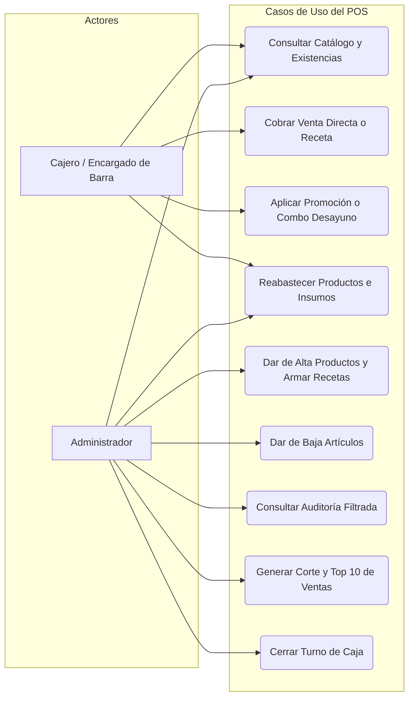

# Sistema de Gestión de Inventario y Punto de Venta (POS) - Cafetería ITCH II

Sistema integral para la administración de inventario, recetas de barra, promociones automáticas, venta en mostrador y auditoría financiera desarrollado en **C# (.NET 10)** con persistencia relacional en **SQLite**. Implementado bajo los principios de la **Programación Orientada a Objetos (POO)** y las directrices de ingeniería de software del **Tecnológico Nacional de México Campus Chihuahua II**.

---

## 1. Fundamentos de Diseño Orientado a Objetos (POO)

* **Abstracción y Encapsulamiento:** Clases base con atributos protegidos/públicos y operaciones de negocio controladas en capas de servicio desacopladas.
* **Herencia (Generalización):** Clase abstracta `ItemInventarioBase` especializada en `ProductoTerminado` (artículos físicos directos) y `ProductoElaborado` (preparaciones por receta).
* **Polimorfismo por Sobrescritura (`Override`):** Redefinición del método abstracto `DescontarExistencias(decimal)` según la naturaleza del artículo.
* **Polimorfismo por Sobrecarga (`Overload`):** Múltiples firmas en métodos de venta para procesar cobros regulares o aplicar promociones y descuentos porcentuales (`RegistrarVenta(sku, cant)` vs `RegistrarVenta(sku, cant, desc)`).
* **Composición:** Relación de vida dependiente entre un producto preparado y su lista de insumos (`Ingrediente`).
* **Búsqueda Universal (Smart Search):** Resolución polimórfica compatible con lectores de códigos de barras (EAN-13), códigos numéricos de teclado rápido o cadenas de texto parciales.
* **Blindaje y Manejo de Excepciones:** Desacoplamiento de la validación de entradas mediante `ConsolaHelper` y bloques `try-catch` transaccionales para garantizar una operación continua y tolerante a fallos de usuario.

---

## 2. Diagrama de Clases UML

```mermaid
classDiagram
    direction TB

    %% Jerarquía de Herencia
    class ItemInventarioBase {
        <<abstract>>
        +long Id
        +string Sku
        +string Nombre
        +decimal Precio
        +decimal Costo
        +decimal Existencias
        +decimal StockMinimo
        +bool TieneBajoStock
        +DescontarExistencias(decimal cantidad)* bool
    }

    class ProductoTerminado {
        +ProductoTerminado(long id, string sku, string nombre, decimal precio, decimal costo, decimal stockInicial)
        +DescontarExistencias(decimal cantidad) bool
    }

    class ProductoElaborado {
        -List~Ingrediente~ Receta
        +ProductoElaborado(long id, string sku, string nombre, decimal precio, decimal costo)
        +AgregarIngrediente(Ingrediente ingrediente) void
        +DescontarExistencias(decimal porciones) bool
    }

    class Ingrediente {
        +long Id
        +string Nombre
        +decimal CantidadRequerida
        +string UnidadMedida
        +Ingrediente(long id, string nombre, decimal cantidadRequerida, string unidadMedida)
    }

    class MovimientoInventario {
        +long Id
        +string ProductoSku
        +TipoMovimiento Tipo
        +decimal Cantidad
        +string Motivo
        +DateTime Fecha
        +string EstadoTurno
    }

    class ReporteCorteCaja {
        +DateTime FechaGeneracion
        +int TotalTransaccionesVenta
        +decimal TotalUnidadesVendidas
        +decimal TotalIngresos
        +decimal TotalGananciaEstimada
    }

    %% Capa de Servicios y Utilidades
    class BaseDatosServicio {
        -string CadenaConexion
        +ObtenerConexion() SqliteConnection
        -InicializarBaseDatos() void
    }

    class InventarioServicio {
        -BaseDatosServicio _bd
        +ListarProductos() void
        +ListarInsumosBarra() void
        +ListarInsumosConId() void
        +BuscarProductoUniversal(string criterio) ProductoTerminado
        +TieneReceta(string sku) bool
        +RegistrarVenta(string sku, decimal cantidad) bool
        +RegistrarVenta(string sku, decimal cantidad, decimal porcentajeDescuento) bool
        +VenderProductoElaborado(string sku, decimal porciones) bool
        +VenderProductoElaborado(string sku, decimal porciones, decimal porcentajeDescuento) bool
        +ReabastecerStock(string sku, decimal cantidad) bool
        +ReabastecerInsumo(long insumoId, decimal cantidad) bool
        +RegistrarNuevoProducto(string sku, string nombre, decimal precio, decimal costo, decimal stock, decimal minimo) bool
        +RegistrarNuevoInsumo(string nombre, string unidad, decimal stock, decimal minimo) bool
        +RegistrarProductoElaborado(string sku, string nombre, decimal precio, decimal costo) bool
        +AgregarIngredienteAReceta(string sku, long insumoId, decimal cantidadRequerida) bool
        +EliminarProducto(string sku) bool
        +VerHistorialMovimientos(string filtro, string valorFiltro) void
    }

    class CajaServicio {
        -BaseDatosServicio _bd
        +GenerarCorteTurno() ReporteCorteCaja
        +MostrarTopProductosVendidos(int top) void
        +MostrarResumenBajasTurno() void
        +CerrarTurnoCaja() void
    }

    class ConsolaHelper {
        <<static>>
        +LeerDecimalPositivo(string mensaje, bool permitirCero) decimal
        +LeerEnteroPositivo(string mensaje) long
        +LeerTextoNoVacio(string mensaje) string
        +PausaContinuar() void
    }

    %% Relaciones
    ItemInventarioBase <|-- ProductoTerminado : Herencia
    ItemInventarioBase <|-- ProductoElaborado : Herencia
    ProductoElaborado *-- Ingrediente : Composición (1..*)
    
    InventarioServicio ..> BaseDatosServicio : Dependencia
    CajaServicio ..> BaseDatosServicio : Dependencia
    InventarioServicio ..> ProductoTerminado : Manipula
    InventarioServicio ..> MovimientoInventario : Registra
    CajaServicio ..> ReporteCorteCaja : Genera
```



---

## 3. Diagrama de Casos de Uso (Flujos del Sistema)



---

## 4. Instrucciones de Compilación y Ejecución

1. Situarse en la carpeta raíz del proyecto de consola:
   ```bash
   cd /workspaces/CafeteriaITCHII/CafeteriaInventario
   ```
2. Compilar y ejecutar con el CLI de .NET:
   ```bash
   dotnet run
   ```