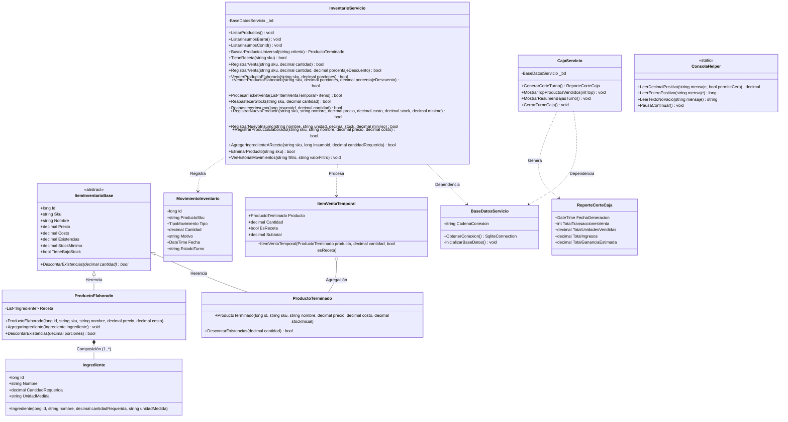

# Sistema de Gestión de Inventario y Punto de Venta (POS) - Cafetería ITCH II

Sistema integral para la administración de inventario, recetas de barra, venta de mostrador multilínea (estilo supermercado/ticket atómico), promociones automáticas y auditoría financiera desarrollado en **C# (.NET 10)** con persistencia relacional en **SQLite**. Desarrollado bajo los principios de la **Programación Orientada a Objetos (POO)** y la metodología de ingeniería de software del **Tecnológico Nacional de México Campus Chihuahua II**.

---

## 1. Fundamentos Arquitectónicos y Metodología (TecNM II)

* **Abstracción y Encapsulamiento:** Ocultamiento de la representación interna de datos y exposición de operaciones de negocio mediante contratos de servicio.
* **Herencia (Generalización):** Clase base abstracta `ItemInventarioBase` especializada en `ProductoTerminado` (físico directo) y `ProductoElaborado` (artículo elaborado por receta).
* **Polimorfismo:** Sobrescritura (`override`) de `DescontarExistencias` y sobrecarga (`overload`) de métodos para ventas regulares vs. ventas con descuentos o promociones combinadas.
* **Composición y Agregación:** 
  * `ProductoElaborado` mantiene una relación existencial fuerte de composición con sus `Ingrediente` (1..*).
  * El ticket de compra utiliza agregación temporal con instancias de `ItemVentaTemporal`.
* **Transacciones Atómicas (ACID):** Despacho seguro de órdenes multilínea (`ProcesarTicketVenta`) donde la deducción de ingredientes de recetas y stock físico ocurre dentro de un bloque transaccional (`BeginTransaction` / `Commit` / `Rollback`).
* **Blindaje de Entradas:** Validación centralizada mediante `ConsolaHelper` para mitigar errores de captura sin interrumpir el ciclo de vida de la aplicación.

---

## 2. Diagrama de Clases UML



---

## 3. Diagrama de Secuencia: Venta Multilínea y Liquidación Atómica

```mermaid
sequenceDiagram
    autonumber
    actor Cajero
    participant Vista as Program (Consola / GUI)
    participant Carrito as List~ItemVentaTemporal~
    participant Servicio as InventarioServicio
    participant BD as SQLite (cafeteria.db)

    loop Captura de Artículos (Estilo Supermercado)
        Cajero->>Vista: Escanea código o ingresa nombre + cantidad
        Vista->>Servicio: BuscarProductoUniversal(criterio)
        Servicio->>BD: SELECT producto / receta
        BD-->>Servicio: Registro de catálogo
        Servicio-->>Vista: Instancia ProductoTerminado
        Vista->>Carrito: Add(ItemVentaTemporal)
        Carrito-->>Vista: Subtotal acumulado en pantalla
    end

    Cajero->>Vista: Comando 'cobrar' / 'pagar'