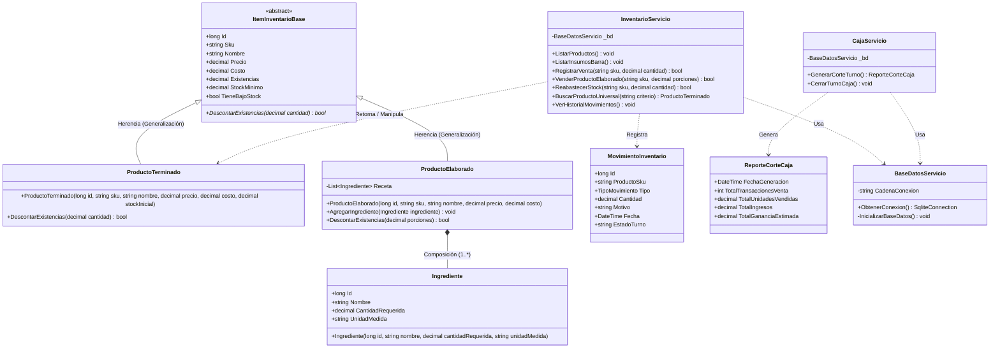
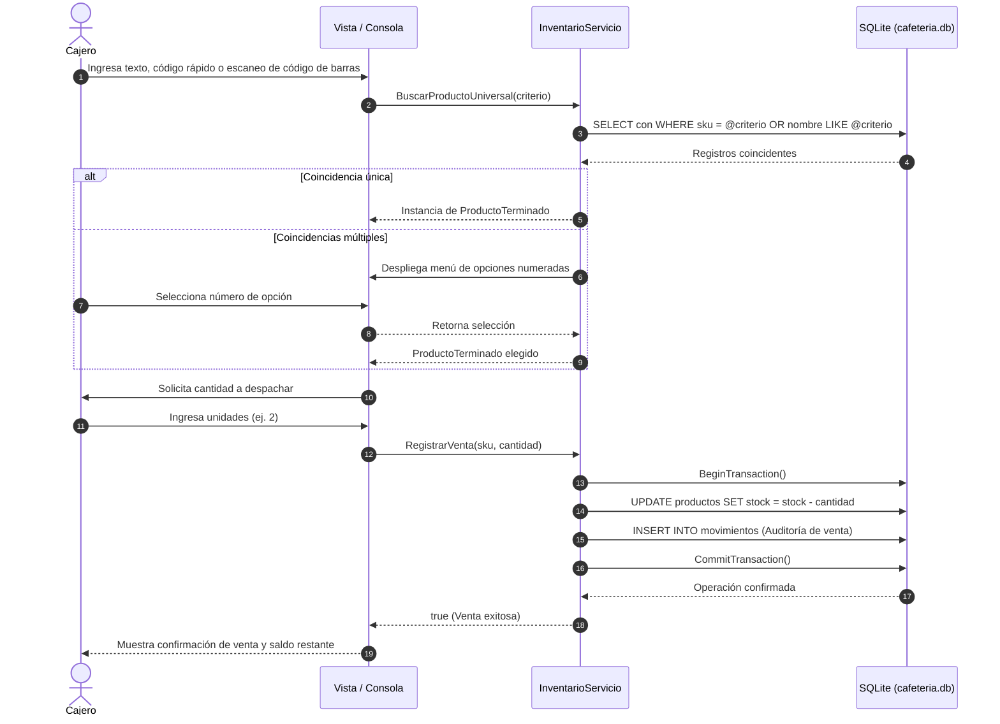

# Sistema de Gestión de Inventario y Punto de Venta (POS) - Cafetería ITCH II

Sistema modular para el control de inventario, recetas de barra, venta en mostrador y cortes de caja desarrollado en **C# (.NET 10)** y persistencia relacional con **SQLite**. Diseñado bajo los principios de la **Programación Orientada a Objetos (POO)** y la metodología de desarrollo de software del **Tecnológico Nacional de México Campus Chihuahua II**.

---

## 1. Metodología de Desarrollo (TecNM II)

El proyecto se estructuró siguiendo las etapas formales de ingeniería de software:
1. **Análisis del problema y requerimientos:** Identificación de entradas (SKU alfanumérico, códigos de barra EAN-13, teclado rápido, nombres), restricciones de stock y salidas deseadas (bitácora, deducciones y corte financiero).
2. **Diseño y estructuración de clases:** 
   - Abstracción de entidades base (`ItemInventarioBase`).
   - Jerarquía de generalización/especialización (Herencia) para productos directos y preparados.
   - Relación de composición estricta para el modelado de recetas e insumos.
3. **Implementación y desacoplamiento:** Separación en capas de **Modelos** y **Servicios** con persistencia atómica mediante transacciones SQL.
4. **Prueba y verificación final:** Validación con conjuntos de datos reales (ventas unitarias, recetas compuestas, prevención de sobreventa y cierres de turno).
5. **Mantenimiento y actualización:** Incorporación de búsqueda universal polimórfica (*Smart Search*) y umbrales de stock mínimo configurables por producto.

---

## 2. Diagrama de Clases UML (Estructura y Relaciones)

El siguiente diagrama modela la arquitectura completa del backend, reflejando generalización, composición, encapsulamiento y dependencias de servicio:



---

## 3. Diagrama de Secuencia: Venta con Smart Search y Descuento Atómico

Representa el flujo de control, llamadas y persistencia al procesar una venta desde la consola:



---

## 4. Ejecución del Proyecto

1. Posicionarse en la carpeta del ejecutable:
   ```bash
   cd /workspaces/CafeteriaITCHII/CafeteriaInventario
   ```
2. Ejecutar la aplicación:
   ```bash
   dotnet run
   ```