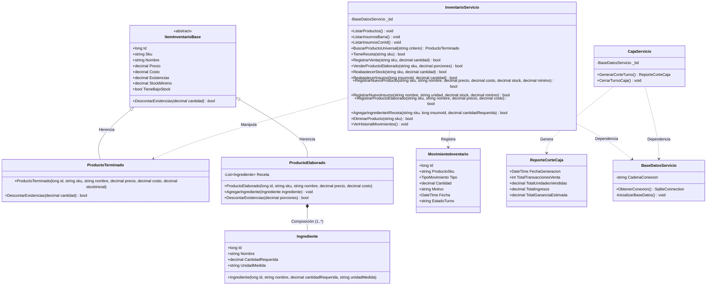
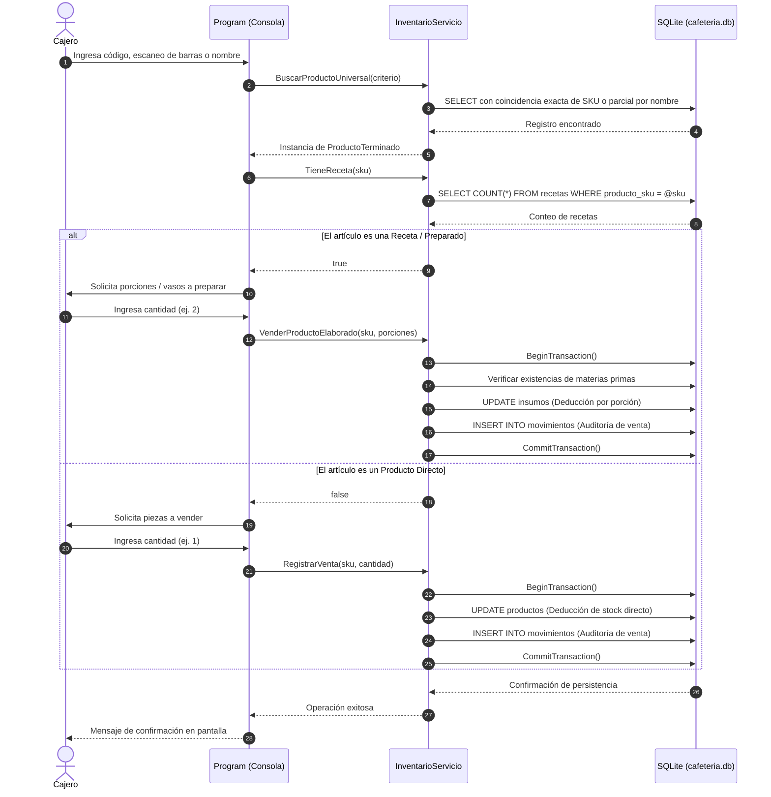

# Sistema de Gestión de Inventario y Punto de Venta (POS) - Cafetería ITCH II

Sistema integral para la administración de inventario, recetas de barra, reabastecimiento, venta en mostrador y auditoría financiera desarrollado en **C# (.NET 10)** con persistencia relacional en **SQLite**. Desarrollado bajo los principios de la **Programación Orientada a Objetos (POO)** y la metodología de ingeniería de software del **Tecnológico Nacional de México Campus Chihuahua II**.

---

## 1. Fundamentos Arquitectónicos y Metodología (TecNM II)

El sistema se diseñó cubriendo las etapas de análisis, diseño, codificación y verificación:
* **Abstracción y Encapsulamiento:** Clases base con atributos protegidos/públicos y operaciones de negocio controladas.
* **Herencia (Generalización):** Clase abstracta `ItemInventarioBase` como superclase de `ProductoTerminado` y `ProductoElaborado`.
* **Polimorfismo:** Implementación del método abstracto `DescontarExistencias(decimal)` redefinido (`override`) según el comportamiento de la entidad.
* **Composición:** Relación existencial fuerte entre un producto preparado y su lista de insumos (`Ingrediente`).
* **Búsqueda Universal (Smart Search):** Algoritmo de resolución polimórfica que interpreta códigos de barra (EAN-13), códigos numéricos de teclado rápido o cadenas de texto parciales.

---

## 2. Diagrama de Clases UML



---

## 3. Diagrama de Secuencia: Despacho Polimórfico (Directo vs Receta)



---

## 4. Instrucciones de Ejecución

1. Abrir terminal en el directorio del proyecto:
   ```bash
   cd /workspaces/CafeteriaITCHII/CafeteriaInventario
   ```
2. Ejecutar la solución:
   ```bash
   dotnet run
   ```