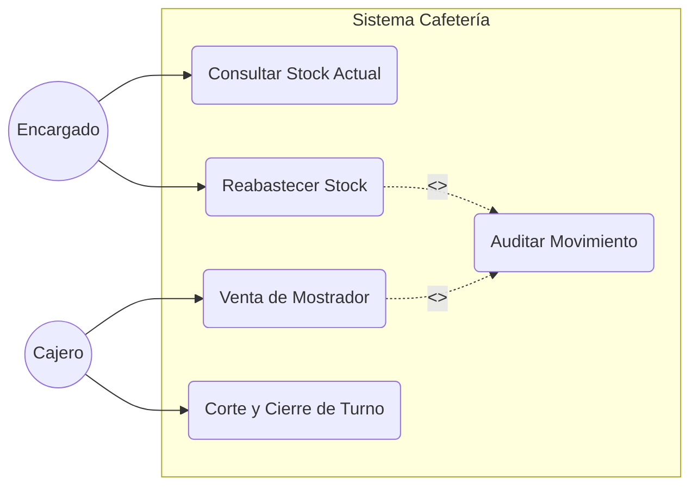
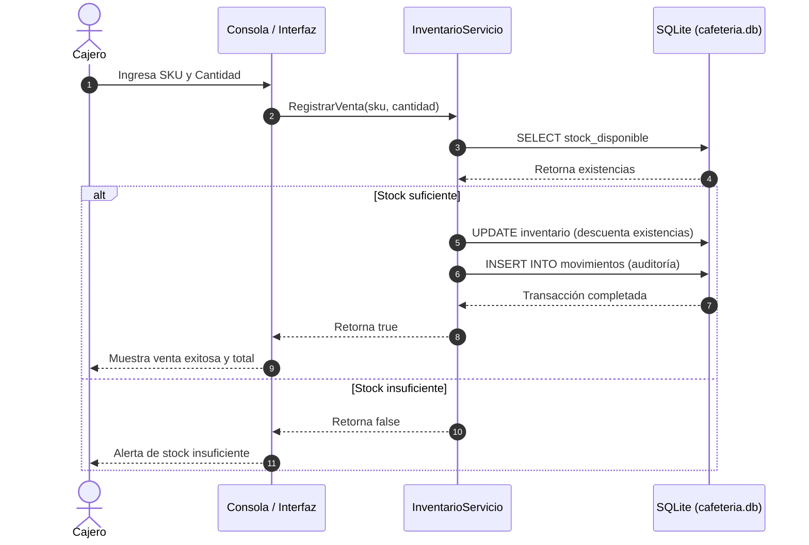

# Sistema de Control de Inventario y Caja - CafeteriaITCHII

Sistema de gestión local para inventario, venta de mostrador, recetas polimórficas y control de caja desarrollado en **C# (.NET 10)** con almacenamiento persistente en **SQLite**.

---

## 1. Análisis del Problema y Requerimientos

* **Entradas (Datos):** Claves SKU de productos, cantidades a transaccionar, confirmaciones de corte de turno y parámetros de venta.
* **Salidas (Resultados):** Catálogo de productos con existencias, cálculo automático de importes, alertas de `[BAJO STOCK]`, historial de movimientos auditados y reportes financieros (ingresos brutos y utilidad estimada).
* **Restricciones:**
  * Almacén de datos persistente en motor local SQLite (`cafeteria.db`) sin dependencias de red.
  * Arquitectura desacoplada de la interfaz de consola para permitir una futura integración con Interfaz Gráfica de Usuario (GUI).
  * Manejo estricto de tipos no nulos (null-safety).

---

## 2. Modelado y Estructura Orientada a Objetos (POO)

El sistema aplica los pilares de la Programación Orientada a Objetos:
* **Clase Abstracta (`ItemInventarioBase`):** Define el contrato común (`DescontarExistencias(decimal cantidad)`).
* **Herencia y Sobrescritura (`ProductoTerminado`):** Redefine la deducción por unidades directas en mostrador.
* **Composición y Polimorfismo (`ProductoElaborado` e `Ingrediente`):** Modela productos con recetas que descuentan existencias de insumos (gramos o mililitros).
* **Servicios Desacoplados:** `InventarioServicio` y `CajaServicio` encapsulan transacciones de base de datos sin comandos acoplados a la consola.

---

## 3. Diagramas de Ingeniería de Software (UML)

### A. Diagrama de Casos de Uso



### B. Diagrama de Secuencia (Venta en Mostrador)



---

## 4. Ejecución del Proyecto

1. Abrir la terminal dentro del directorio del proyecto:
   ```bash
   cd /workspaces/CafeteriaITCHII/CafeteriaInventario
   ```
2. Compilar y ejecutar:
   ```bash
   dotnet run
   ```